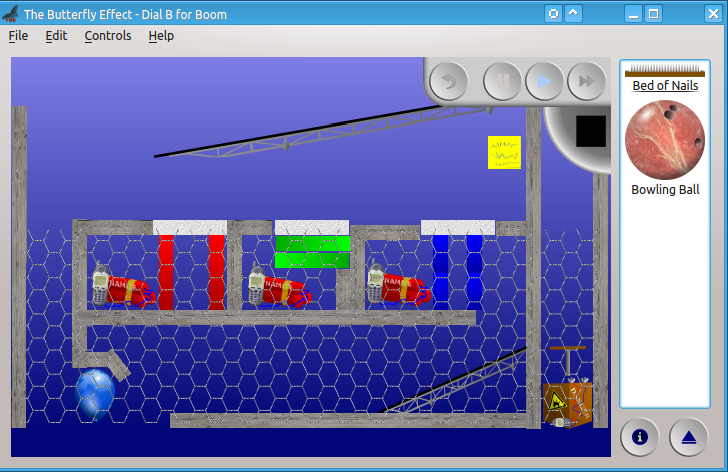
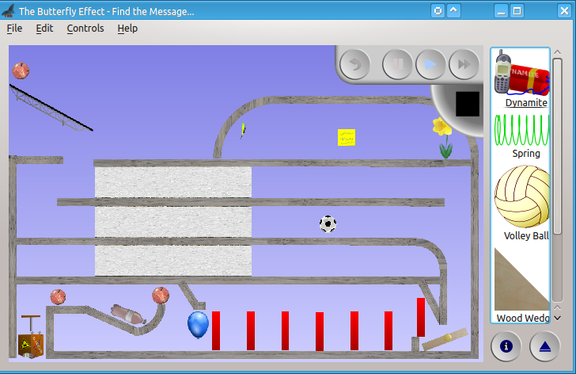
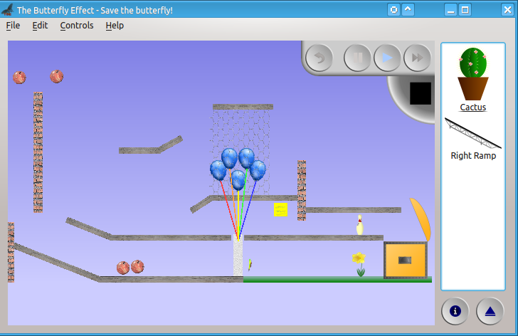
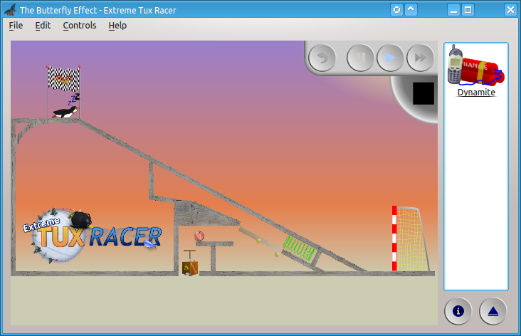
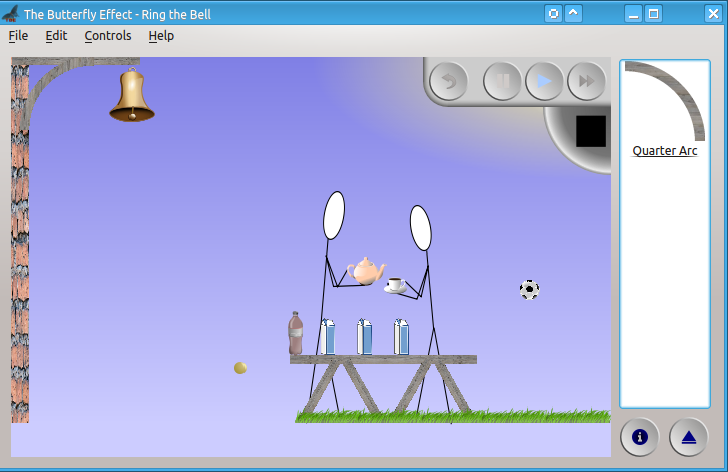

 \* [Features](#Features) \* [Downloads](#Downloads) \* [Open Source](#OpenSource) \*


The Butterfly Effect is a free and open source game that uses realistic physics
simulations to combine lots of simple mechanical elements to achieve a simple
goal in the most complex way possible.

This is a fully playable game of alpha quality, well on its way to a shiny 1.0
release. For anyone who has played earlier versions of the game, you'll notice
a sparkling new user interface - but the same levels and objects.

## Features <a id="Features"></a>

_The Butterfly Effect_ has been over five years in the making. 
That means that even though the game has been designed by hobbyists, the game
is rich in features:
 * Many different objects: cola bottles, balloons, butterflies, domino stones,
   springs, dynamite
 * Many different types of puzzles
 * Works on Linux and Windows
 * Playable in English, Russian, Dutch, Swedish, Spanish German, Malay, and
   several other languages.
   Note that not all languages are 100% [yet](#HelpTranslating)
 * Using vector graphics - all images always rendered at the highest quality
 * There are 45 levels. All levels are playable, but a few levels may need a 
   bit more polish.

## Screenshots

<table border=0 cellspacing=5>
<tr><td>
</td><td>
</td><td>

</td></tr>
<tr><td>
</td><td>
</td><td>

</td></tr>

## Download & Install <a id="Downloads"></a>

We are working on getting packages for major Linux-distributions as well as
a Windows-installer.

Operating System       | MD5SUM | Download
---------------------- | ------ | --------
Debian / Ubuntu / Mint |  TBD   |  TBD.deb
Fedora / CentOS        |  TBD   |  TBD.rpm
Opensuse               |  TBD   |  TBD.rpm
Mageia Linux           |  n/a   |  part of Mageia
Other Linux            |  TBD   |  TBD.sh (self extracting archive)
Windows                |  TBD   |  TBD.exe

_if you are a packager and want to add TBE to a distribution or build for_
_another platform, do not hesitate to [contact the developers](#BugsFeedback)_

### Installation instructions

#### Mageia

Thanks to packager/developer _AlexL_, TBE is available directly from
within Mageia!

#### RPM-based distributions

Every RPM-based distribution allows to use the `rpm` command to install the RPM
package like this (make sure to supply the correct file name):
```
    rpm -ivh thebutterflyeffect.rpm
```

If, however, RPM detects that there are missing dependencies (i.e. the game
needs other libraries or packages that are not yet installed), the resolution
depends on the version of Linux you are using:
 * Fedora / CentOS: use `yum` to install, the yum tool itself will figure out
   missing dependencies and install them.
 * Opensuse: use `zypper` to install, the zypper tool itself will figure out
   missing dependencies and will download & install them:

Of course, you can also use graphical package managers.

The game should add itself to your start menu automatically.

#### DEB-based distributions

Every DEB-based distribution, like _Debian_, _Ubuntu_ and _Linux Mint_ allow
to use the `dpkg` command to install the _.deb_ file. However, that will likely
not work because dpkg is not really good at dependencies.

There are essentially three options:
 * use graphical tools like synaptic
 * use a command line tool called `gdebi`:
   * `sudo apt-get update`
   * `sudo apt-get install gdebi`
   * `sudo gdebi thebutterflyeffect.deb`
 * use the self-extracting archive below.

#### Self-extracting archive

TODO:
 * discuss dependencies
 * discuss executable rights
 * discuss where to install

#### Windows

Download the installer, double click the installer and follow the steps.
The game will be installed and is available in the start menu. The start menu
will also show an `uninstall` icon if you ever want to remove the game again.


## Open Source <a id="OpenSource"></a>

This game is released under the **GPLv2** license.
That _The Butterfly Effect_ is open source, means that you can build the game
yourself, look how we did it and modify the code or the levels.
We'd love for you to submit your changes back to us - we love
[feedback](#BugsFeedback) and will try to incorporate your changes into the
next version of the game.

That's what open source is about: as a community we try to make the best game
possible!

The Butterfly Effect also wouldn't have been possible without other open source
projects, including:
 * [**Qt**](http://www.qt.io/) library for the graphical user interface
 * [**Box2D**](http://box2d.org/) library for physics simulations
 * [**CMake/CPack**](https://cmake.org) tools for configuring and building
   applications
 * [**NSIS**](nsis.sf.net) the Nullsoft Installer is a program to build
   Windows installer tools
 * [**Inkscape**](https://inkscape.org/en/) is a program to draw vector graphics
 * [**Openclipart.org**](Openclipart.org) is a website to share clipart graphics
 * [**git**](https://git-scm.com/) is a tool for source code management.
   It is the backbone of [GitHub](github.com)
 
To be honest, we also use a few commercial offerings, including:
 * [**GitHub**](github.com) a website that hosts source code and websites
 * [**Coverity**](https://scan.coverity.com/) a tool to find software bugs
   through _static analysis_
 * [**Pareon Verify**](https://pareonverify.com) a tool to find software bugs
   though _dynamic analysis_
 * [**Transifex**](https://www.transifex.com/) a website to help translating of
   software

#### Help out with translations <a id="HelpTranslating"></a>

We use the [Transifex](https://www.transifex.com/) project to translate the
user interface. You can sign up and get started at the
[thebutterflyeffect](https://www.transifex.com/Magic/thebutterflyeffect/) page.

TODO: describe how to translate the levels, which are not in Transifex.

#### Help out with new or improved levels

If you have ideas for levels, we'd love to hear from you!

Probably the easiest way to let us know about your ideas, is to create a login
on the [GitHub website](https://github.com/kaa-ching/tbe) and create an issue
for TBE. We'll work with you to make your ideas happen.

Note that _Milestone B_ will feature a level editor again, so you can design
your own levels!

#### Add more code

If you are a C++ programmer, we'd love to hear from you - there's always more
things that can be coded!

Create a login on the [GitHub website](https://github.com/kaa-ching/tbe), clone
the repo and start hacking. We love patches and pull requests!

#### Found any bugs? Or you have feedback? <a id="BugsFeedback"></a>

Oh boy. Does TBE still contain bugs?

Please log in to GitHub 
and [file an issue](https://github.com/kaa-ching/tbe/issues)
or contact lead developer [kaa-ching](https://github.com/kaa-ching) by e-mail.
